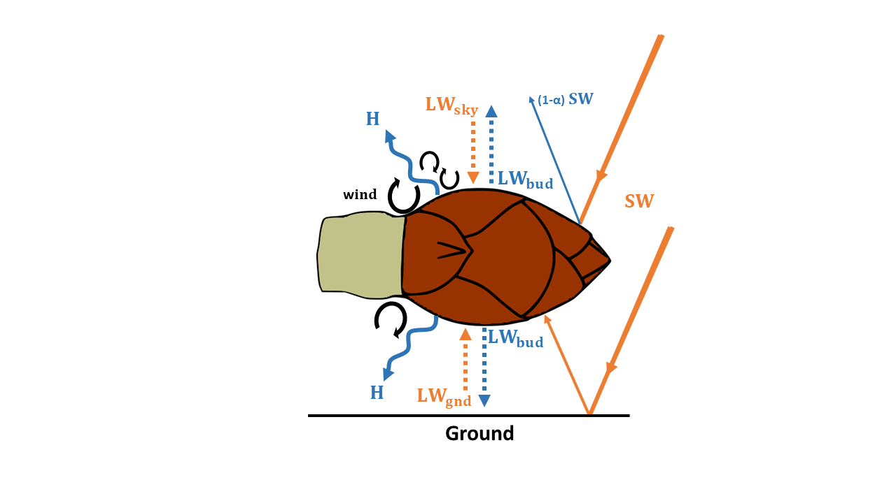

## Overview

*Article acceptance date:* under review

This R-Markdown document provides the instructions for executing the analysis and producing figures presented in the paper *Plants phenological sensitivity to warming resides in their energy budget* by Peaucelle, Penuelas and Verbeeck (2020, submitted). 
All data used for the analyses are freely available after registration on the respective website: 

* PEP data: http://www.pep725.eu/
* CRU-JRA data: https://catalogue.ceda.ac.uk/uuid/13f3635174794bb98cf8ac4b0ee8f4ed
* FLUXNET data: https://fluxnet.fluxdata.org/data/fluxnet2015-dataset/

These data are under specific licence, this is the reason why we did not provide raw data but only processed data in the `database` folder, and file templates in the `templates` folder.  Further information about data processing and creating the data file is given below (section 'Data processing'). Using RMarkdown and open access code available through github (https://github.com/mpeaucelle/Tbud) this is supposed to allow for full reproducibility of published results - from publicly accessible data files to published figures. 

## IP information
All code [in this repository](https://github.com/mpeaucelle/Tbud) is free software. It may be redistributed and/or modified under the terms of the GNU General Public License as published by the Free Software Foundation, version 3. Present code is distributed in the hope that it will be useful, but WITHOUT ANY WARRANTY; without even the implied warranty of MERCHANTABILITY or FITNESS FOR A PARTICULAR PURPOSE. See the GNU General Public License (file `./LICENSE`) for more details.

In case you use or modify this code, please cite the original work as: 
XXX citation XXX 

Copyright (C) 2020  Marc Peaucelle

## Approach
### Bud energy budget
We quantify the effective temperature of buds by applying a simple energy budget model based on [@Landsberg1974], [@Hamer1985] and equations from [@Muir2019].
For an isolated bud, the amount of absorbed incoming radiation (Rabs) is balanced by the thermal infrared radiation loss (${\mathrm{LW}_{\mathrm{bud}}}$ ) and the energy lost by conduction and convection, generally called the sensible heat flux (H). To simulate bud temperature, we considered that the energy balance is close to equilibrium at a time scale of a few minutes, consistent with temporal resolution of meteorological observations from FLUXNET sites (30 min) and CRU-JRA (6 h):
$$
\mathrm{R}_{\mathrm{abs}} = \mathrm{H}+ \mathrm{LW}_{\mathrm{bud}}
$$
The amount of absorbed energy by buds is the sum of incoming shortwave (SW, visible and near-infrared) and longwave (LW, infrared) radiations:
$$
\mathrm{R}_{\mathrm{abs}} = \mathrm{\alpha}_{\mathrm{SW}}(1+r)SW + \mathrm{\alpha}_{\mathrm{LW}} (\mathrm{LW}_{\mathrm{sky}}+\mathrm{LW}_{\mathrm{gnd}})/2
$$
where ${\mathrm{\alpha}_{\mathrm{SW}}}$ is the bud absorptivity to SW; r is the fraction of SW reflected by the ground and ${\mathrm{\alpha}_{\mathrm{LW}}}$ is the bud absorptivity to LW, which is here defined as the average of LW coming from the atmosphere ${\mathrm{LW}_{\mathrm{sky}}}$ and coming from the ground ${\mathrm{LW}_{\mathrm{gnd}}}$. 
LW emitted by surrounding objects such as branches were considered negligible. Since no data were available in the literature, we set ${\mathrm{\alpha}_{\mathrm{LW}}}$ to 0.97, which corresponds to the average absorptivity for leaves and needles [@Jones2013]. We tested two different values of ${\mathrm{\alpha}_{\mathrm{SW}}}$, 0.5 and 0.8, corresponding to values commonly used for leaves and needles, respectively. We set r to 0.2, which corresponds to a reasonable value for the fraction of SW reflected by grasses. Of course, r will strongly vary according to the albedo of the ground (e.g. understory/grass, forest litter, snow, etc.), which was simplified here for our perspective. 

{ width=50% }

In our example, we simplified the estimation of ${\mathrm{LW}_{\mathrm{gnd}}}$ by considering that ground temperature equals air temperature:
$$
\mathrm{LW}_{\mathrm{gnd}} = \mathrm{\sigma}\mathrm{\alpha}_{\mathrm{LW}}\mathrm{T}_{\mathrm{air}}^4
$$
where $\mathrm{\sigma}$ is the Stefan-Boltzmann constant and ${\mathrm{\alpha}_{\mathrm{LW}}}$ is the bud emissivity (which is equal to its absorptivity) to longwave radiations. 
This is an important oversimplification to keep in mind since ground temperature will strongly depend on soil type, vegetation and snow cover, soil humidity, but also the fact that soil heat capacity is generally higher than air.

Buds lose thermal infrared radiation proportionally to their temperature as: 
$$
\mathrm{LW}_{\mathrm{bud}} = \mathrm{\sigma}\mathrm{\alpha}_{\mathrm{LW}}\mathrm{T}_{\mathrm{bud}}^4
$$
where $\mathrm{\sigma}$ is the Stefan-Boltzmann constant and ${\mathrm{\alpha}_{\mathrm{LW}}}$ is the bud emissivity (which is equal to its absorptivity) to longwave radiations.

Finally, the sensible heat flux depends on the air to bud temperature gradient and is formulated as in Muir [-@Muir2019]: 
$$
\mathrm{H} = \mathrm{P}_{a}\mathrm{C}_{\mathrm{p}}\mathrm{g}_{\mathrm{b}}(\mathrm{T}_{\mathrm{bud}}-\mathrm{T}_{\mathrm{air}})
$$
where $\mathrm{P}_{a}$ is the density of dry air; $\mathrm{C}_{\mathrm{p}}$ is the specific heat capacity of air at constant pressure and $\mathrm{g}_{\mathrm{b}}$ is the boundary-layer conductance to heat. 

In our example, we simplified bud’s shape as a spherical object with a diameter of 5 mm to computes the boundary-layer conductance to heat. Please refers to Hamer [-@Hamer1985] for a detailed discussion of this assumption, as well as empirical formulations for the convective heat transfer of apple buds. Condition for laminar and turbulent flows, as well as constants a, b, c and d for a spherical object can be found in Monteith and Unsworth [-@Monteith2013].


### Bud temperature estimation
Bud temperature was estimated by solving for the equilirium of the energy budget at each time-step (30 min for FLUXNET, 6 h for CRU-JRA) and for each site. 

## Process sequence
The following provides a documentation and instruction to reproduce results and figures presented in the paper. 
Data processing (`0_create_database_Tbud.R` and `2_Figures_Fluxnet.R`) requires raw data to run properly. Please download raw data from the dedicated website and format the data according to the template files in the `templates` folder. 

Figures and analyses with PEP data (`1_Figures_PEP_CRUJRA.R`) can be directly reproduced with processed data available in the `database` folder for each studied species. 

### 1. Requirements and environment setup

The execution of the scripts provided here requires the following R packages only for data preprocessing. Analysis can be performed with the base package. 
Refers to the following script `0_create_database_Tbud.R`.

```{r}
list.of.packages <- c("RNetCDF", "raster", "xts","ggplot2")
new.packages <- list.of.packages[!(list.of.packages %in% installed.packages()[,"Package"])]
if( length(new.packages) ) install.packages(new.packages)
```

Define working directory. Define the path variable used throughout multiple scripts and functions. 

```{r}
workingdir <- getwd()
print( paste("working directory directory:", workingdir ) )
workdir <- "/AddWorkdirHere"
```

Get additional utility functions.
```{r}
source("Tbud.R") # Estimate bud temperature. Call Ebalance.R
source("Ebalance.R") # Estimate the energy balance of bud
source("functions.R") # Several functions for averaging, etc..
```

### 2. Data processing
FLUXNET data were directly used without any particular pre-processing. Only the quality and continuity of data was checked for the example provided in the paper. 
PEP data were processed with the script `0_create_database_Tbud.R`.

PEP and CRU-JRA raw data were processed following these steps for each species: 

1. Load PEP and CRU-JRA data
2. Select PEP data corresponding to leaf unfolding observations (BBCH = 11)
3. Retrieve corresponding pixel of CRU-JRA (0.25° resolution) for each site
4. Extract meteorological data for each pixel and each site
5. Computes preseason (3 months preceding budburst) meteorological conditions, as well as forcing and chilling, for each observation. 
6. Merge data and save the new dataset in .rds

**1 Note that CRU-JRA are based on a no-leap calendar. Leap years were added manually to match phenological observations by duplicating the last day (i.e. XXXX/12/31) of the corresponding year. **

**2 Note that CRU-JRA data were linearized to improve computing time. Meteorological variables can be easily extracted from raw 2D CRU-JRA data using the 'raster' package and site longitude-latitude, however the script `0_create_database_Tbud.R` will have to be adapted in accordance.**


### 3. Data analysis
#### PEP data (Figures 3 and 4, Supplementary Figures 1-8)
Processed .rds data files in  `./database/` contain for each site all the data used for analyses and for plotting the figures presented in the paper. 

The script `1_Figures_PEP_CRUJRA.R` plots Figures 3 and 4 and Supplementary Figures 1-8. 
To generate the figures simply run the script as: 
```{r eval=FALSE}
source("1_Figures_PEP_CRUJRA.R")
```

This script executes the following tasks: 

1. Load .rds data for each species and merge them all in a unique variable with all species and sites togethers
2. Select sites with at least 10 observations
3. Computes mean yearly values (and standard deviation) with all sites pooled together, by species and for all species over 1970-2015
4. Generate Figures with yearly data


#### FLUXNET data (Figure 1b and 2)
The script `2_Figures_Fluxnet.R` plots Figures 1b and 2 from FLUXNET data. As mentioned above, FLUXNET data are not provided in the repository, but are freely accessible after registration on the dedicated website. 

To generate the figures, please format raw FLUXNET data according to the netcdf template file `template_fluxnet.nc` provided in the `templates` folder and adjust the netcdf file name in the script ` 2_Figures_Fluxnet.R`: 

```{r eval=FALSE}
forcing<-"FR-Hes_1997-2006.nc"
```

Finally, simply source the script. 
```{r eval=FALSE}
source("2_Figures_Fluxnet.R")
```

This script executes the following tasks: 

1. Load Fluxnet data
2. Computes Bud temperature with two different solar absorptivity by calling the function Tbud in Tbud.R
3. Computes Chilling and forcing requirement of buds from air temperature and bud temperature
4. Generate Figures

## References

